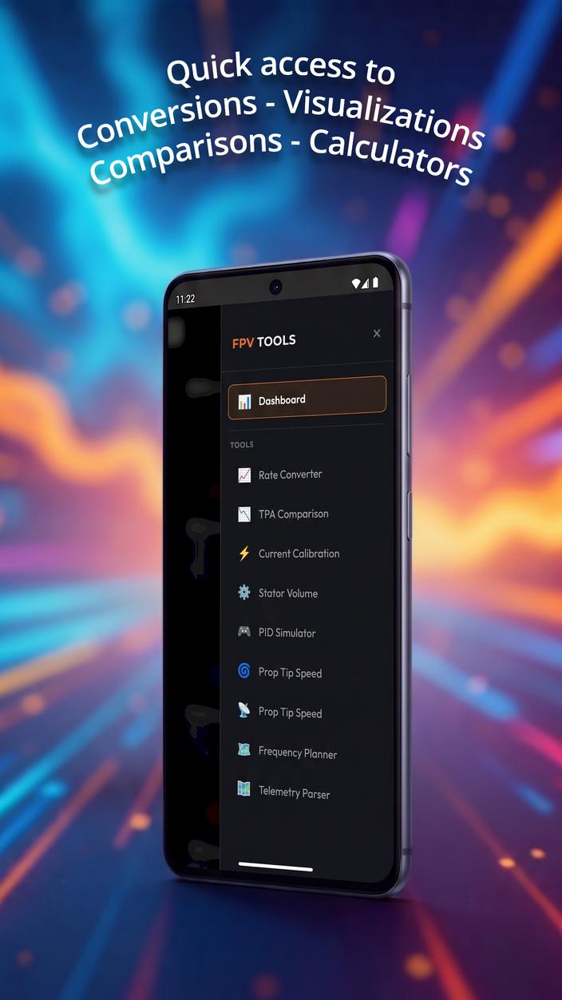
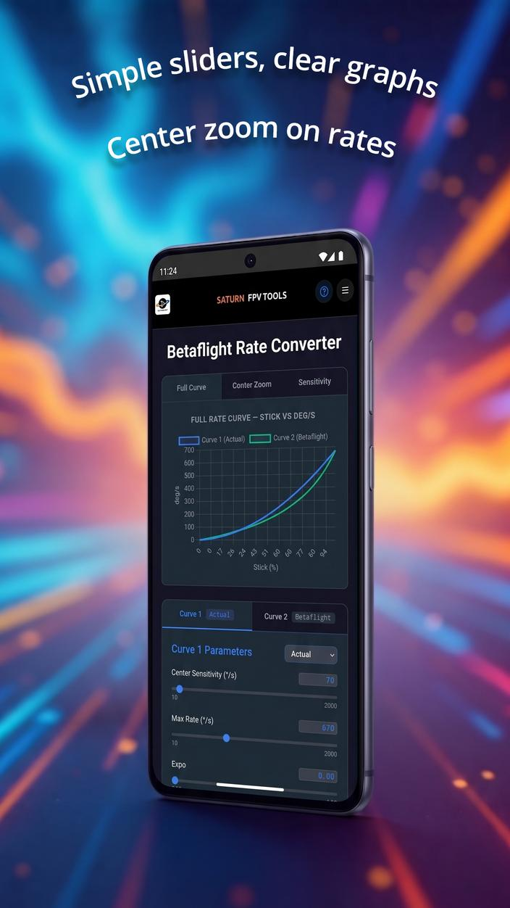
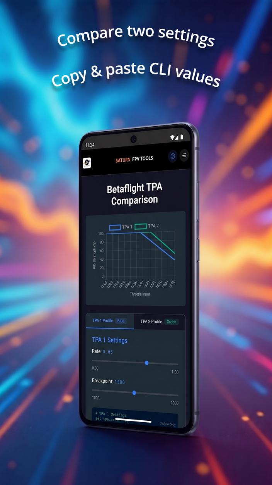
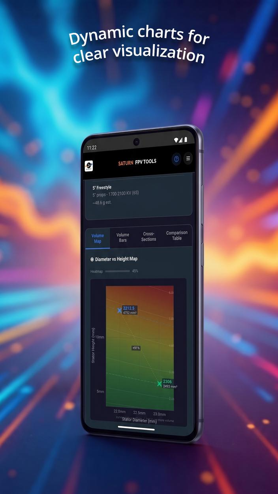
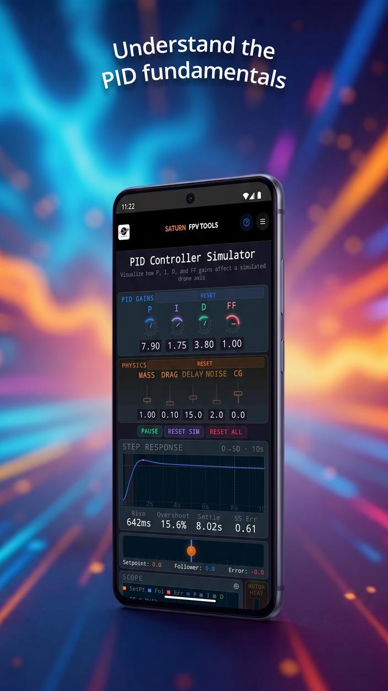
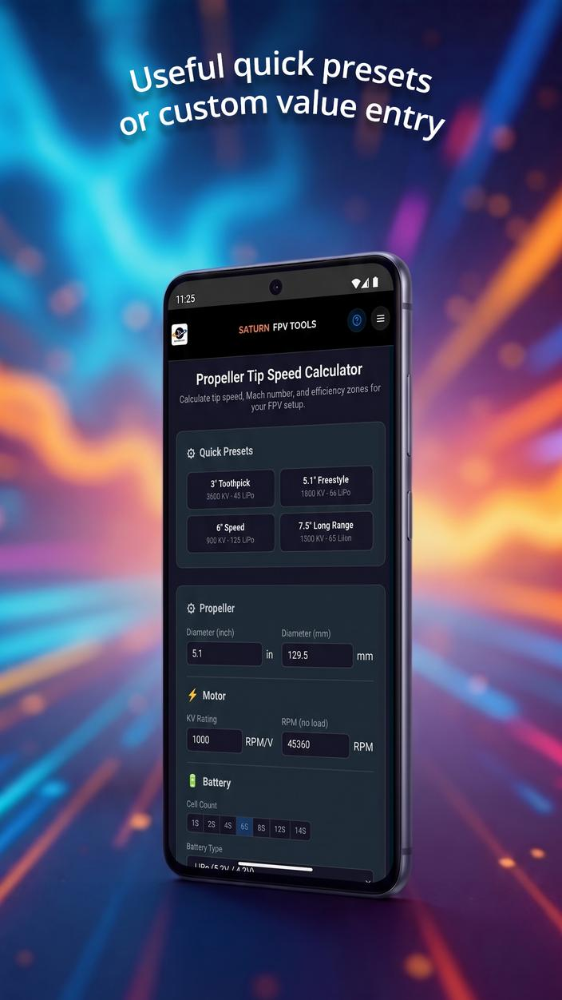
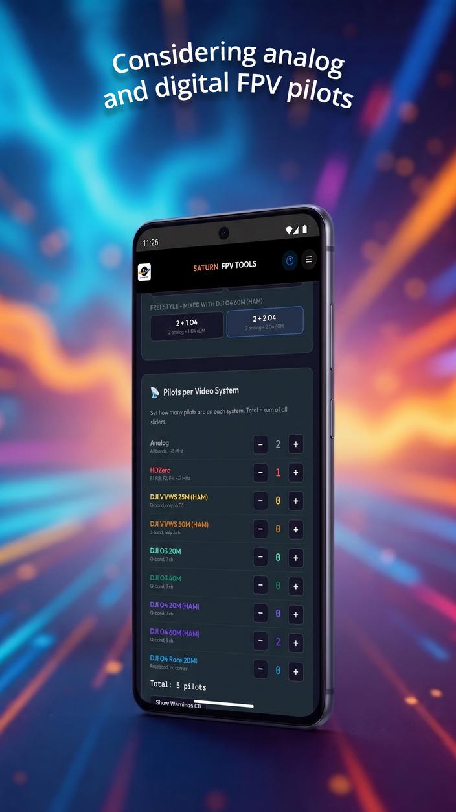
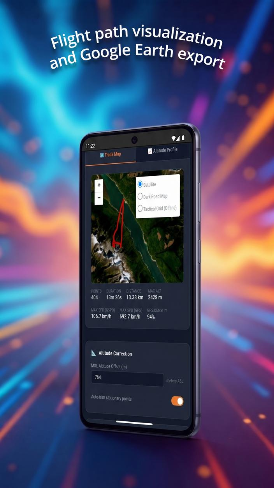

# FPV Tools

[](https://play.google.com/store/apps/details?id=com.saturnfpv.fpvtools)
[](https://github.com/saturn-fpv/fpv-tools/releases)
[](https://github.com/saturn-fpv/fpv-tools/releases)
[](https://developer.android.com)
[](LICENSE)
[](https://www.patreon.com/SaturnFPV)

FPV Tools is an open-source utility and visualization suite designed for FPV drone pilots, builders, and racers. It provides offline tools to model motor sizes, compare rate curves, plan frequencies, visualize flight telemetry, and simulate PID controllers.

Designed with a high-contrast dark theme optimized for outdoor readability, FPV Tools works completely offline, contains no ads, and respects your privacy.

<table width="100%">
  <tr>
    <td width="33%"></td>
    <td width="33%"></td>
    <td width="33%"></td>
  </tr>
  <tr>
    <td width="33%"></td>
    <td width="33%"></td>
    <td width="33%"></td>
  </tr>
  <tr>
    <td width="33%"></td>
    <td width="33%"></td>
    <td width="33%"></td>
  </tr>
</table>

---

## Key Features

* 📈 **Betaflight Rate Converter**: Overlay and compare rate curves dynamically across multiple tabs. Supports Actual, Betaflight, KISS, QuickRates, and RaceFlight rate models. Adjust rates and expo via sliders, inspect stick sensitivity, and generate configuration CLI commands.
* 📉 **Betaflight TPA Comparison**: Compare multiple TPA curves side-by-side to see how PIDs attenuate across the throttle range to prevent high-throttle oscillations.
* ⚡ **Betaflight Sensor Calibration**: Calibrate OSD current and voltage scale coefficients for your flight controller based on battery recharge logs from your charger.
* ⚙️ **Motor Stator Comparator**: Model and compare stator dimensions (such as 2306 vs. 2207, or 1303 vs. 1204) with visual cylinder models. Instantly compare volume distributions and calculate physical volume to help choose the right motor size for your build.
* 🌀 **Propeller Tip Speed Calculator**: Input KV, cell count/voltage, and propeller diameter to calculate prop tip speed (Mach velocity) relative to the speed of sound.
* 🎮 **PID Controller Simulator**: Model overshoot, settling time, and tracking errors on an animated step-response graph to help visualize how P, I, and D parameters affect flight dynamics. *(Based on the original simulator by Joshua Bardwell, with additional improvements)*
* 📡 **VTX Frequency Planner**: Coordinate channels for Analog and Digital video transmitters (HDZero, Walksnail, DJI O3/O4). Checks for Intermodulation Distortion (IMD) conflicts, organizes pilots into heats, and suggests optimal channel assignments.
* 🗺️ **EdgeTX Telemetry Log Parser**: Convert raw EdgeTX, OpenTX, or FreedomTX telemetry log files (`.csv`) containing TBS Crossfire or ExpressLRS (CRSF) GPS data into KML/KMZ tracks. Applies altitude calibration for terrain-following, enabling 3D flyovers of your flights in Google Earth.

---

## App Philosophy / Why Pilots Trust FPV Tools

* 🚫 **100% Offline-First**: Performs all calculations and charts locally on your device. Works at remote launch sites or race parks with no internet or cellular connection. (An internet connection can add a map layer to the telemetry parser tool but is not required.)
* 🔒 **Privacy by Design**: No ads, no in-app purchases, and no tracking. FPV Tools does not collect, store, or upload any of your data—everything remains private on your phone.
* 📖 **Fully Open Source**: The source code is published under the GPL v3, inviting anyone to inspect, verify, and contribute.
* ☀️ **Designed for the Field**: A high-contrast, battery-saving dark interface designed for readability under direct sunlight.
* 📱 **Modern Display Layouts**: Safe-area padded layouts designed for modern bezel-less mobile screens.

---

## Development & AI Assistance

This project is developed using modern web techniques and compiled as a hybrid Android application. 

🤖 **AI Assisted Development**: FPV Tools was pair-programmed with agentic AI assistants, to refine mathematics, automate compilation assets, and optimize user experience.

---

## Support Development

If you find this application useful for your builds or race events, please consider supporting future development and maintenance:

💖 **[Support on Patreon](https://www.patreon.com/SaturnFPV)**

---

## Credits & Attributions

**PID Controller Simulator**: The core PID simulator logic and concept are based on Joshua Bardwell's original development. He graciously granted permission to adapt his code (originally demonstrated on his YouTube channel). Since then, we have built on top of that foundation, implementing additional improvements. 
  
  To learn more, check out:
  * [Joshua Bardwell's Original PID Simulator Video](https://www.youtube.com/watch?v=q5VtSrJ3oVQ)
  * [FPV Know-It-All Simulator Page](https://www.fpvknowitall.com/pid-controller-simulator)

---

## Development

FPV Tools is a hybrid Android app. The user interface and calculation engines are written in standard web technologies (HTML, CSS, JS) located in the root directory, which are loaded via an offline WebView wrapper in the `android/` directory.

### Quick Start / Web Testing
To test or edit the web tools, you do not need to build the Android app. Simply open [index.html](file:///d:/Temp/Antigravity/FPV%20Tools/index.html) in any modern web browser.

### Building the Android App
To compile the Android app, ensure you have **JDK 17** and the **Android SDK** installed, then run the following commands from the `android/` directory:

* **Windows**:
  ```powershell
  cd android
  .\gradlew.bat assembleDebug
  ```
* **macOS / Linux**:
  ```bash
  cd android
  ./gradlew assembleDebug
  ```

### Release Signing
Release builds are signed using a keystore configuration loaded from `android/secrets.properties` (which is gitignored). To build a signed release APK:
1. Create a `secrets.properties` file in the `android/` directory with the following variables:
   ```properties
   storeFile=fpvtools-upload-key.jks
   storePassword=your_keystore_password
   keyAlias=your_key_alias
   keyPassword=your_key_password
   ```
2. Place your keystore file (e.g. `fpvtools-upload-key.jks`) in `android/app/`.
3. Run the assemble release command: `./gradlew assembleRelease` (or `.\gradlew.bat assembleRelease` on Windows).

For more detailed codebase standards and architecture guidelines, see [DEVELOPER.md](file:///d:/Temp/Antigravity/FPV%20Tools/DEVELOPER.md).

---

## License

This project is open-source and distributed under the **GNU General Public License v3 (GPL v3)**. See the [LICENSE](LICENSE) file for details.
